# Passo a passo; Como Fazer Root no celular, "Criando Arquivo Boot.img":book:

## O que você irá precisar;

- ***Você vai precisar de um computador:***

- ***Cabo Usb, micro usb ou tipo C:***

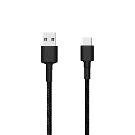

- ***Drivers da Samsung instalados no computador:***

[DRIVERS SAMSUNG👈](https://samsung-usb-driver-for-mobile-phones.softonic.com.br)

- ***7-ZIP Instalado no seu computador;***

[7 - ZIP👈](https://www.7-zip.org/download.html)

- **Samsung Odin, baixar e descompactar em seu computador;**

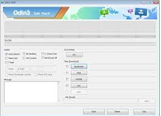

[ODIN👈](https://samsungodin.com)

- **Magisk Instalado em seu celular;**

[MAGISK👈](https://magiskmanager.com)

### **Anotando informações do Celular**

**1. vá em *config.* no seu celular;**

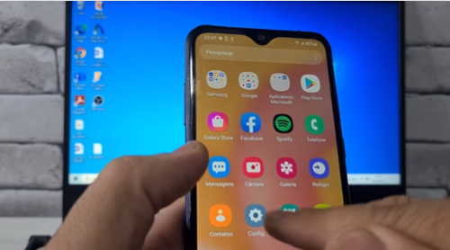

**2. Entre em *Sobre o telefone*;**

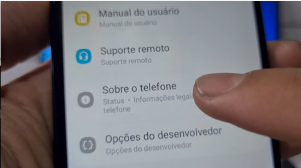

**3. Entre em *Informações do Software*;**

   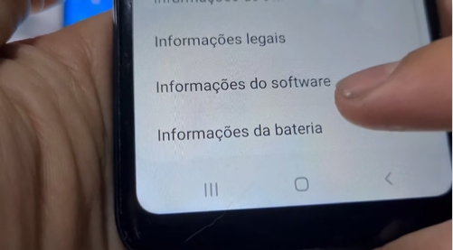

**4. Anote as versões: *do One UI*, *Android*, *número de compilação* e *patch*;**

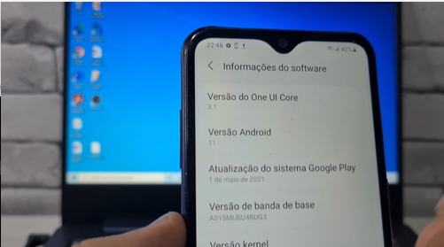

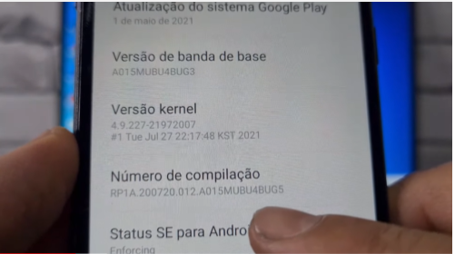

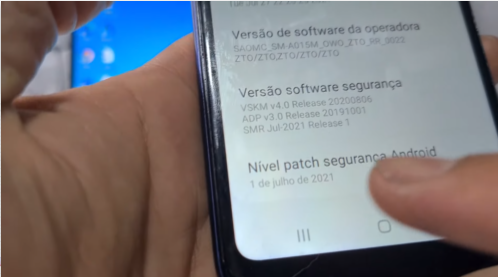

**5. Ente no site da *Stock Roms / Firmwares*, busque pelo número de compilação. Baixe a rom com o mesmo número e patch do seu aparelho;**

[STOCKROM👈](https://www.stockrom.net/samsung)

**6. Extraia os arquivos, com winrar ou 7zip;**

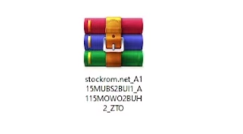

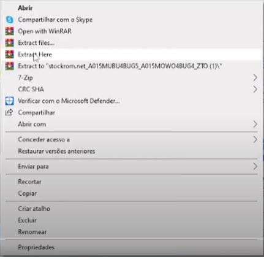

**7. Será  utilizado somente o arquivo AP, click com o botão esquerdo sobre o arquivo, vá em 7-Zip > Extrair Aqui;**

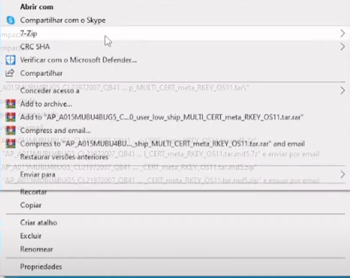

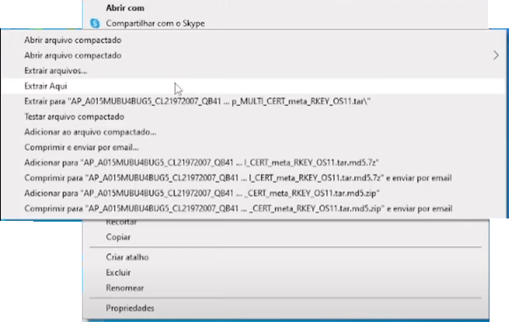

**8. Será extraído alguns arquivos, entre eles o arquivo: bootimg, que será modificado;**

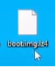

**9. Abra o app 7-zip File Manager e aponte o arquivo boot.img;**

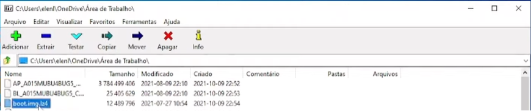

**10. Selecione o arquivo e vá em *adicionar*;**       

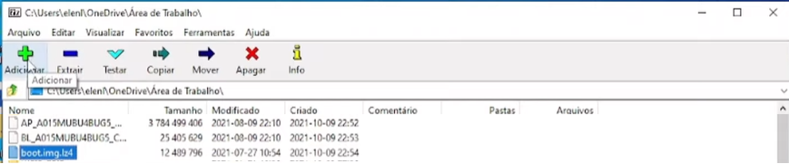

**11. abrirá uma janela, vá em *Formato do arquivo compactado,* selecione "tar" e click em "OK", criará um arquivo de imagem .tar;**

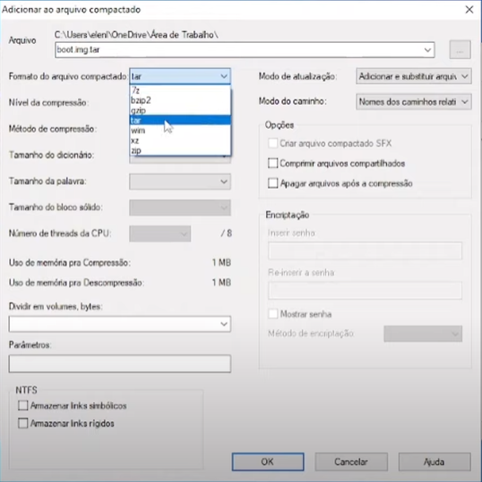

**12. Agora com o cabo usb, conecte o celular ao computador e transfira o arquivo para o celular, na pasta download. Com o Magisk instalado em seu celular, abra o app;**

[MAGISK👈](https://magiskmanager.com)

- **Magisk Instalado em seu celular:**

**13. Ir na opção *instalar*;**

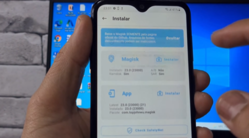
        
**14. Selecione "*Selecione e corrija um arquivo*"**;

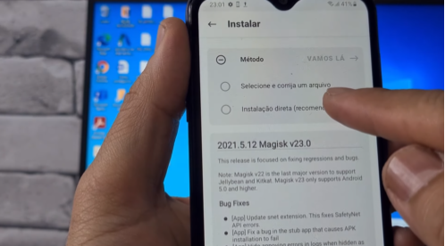

**15. localize o arquivo *boo.timg.tar* e click nele;**

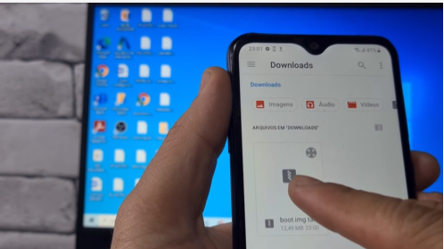

**16. Agora click em "*vamos lá*", Será criado um arquivo corrigido, dentro da pasta download;**

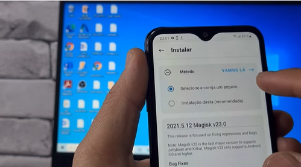

**17. Transfira o arquivo que foi criado "magisk_patched", para o computador via cabo usb;**

**18. Abra a pasta do Odin e click em Odin, click em "AP" e aponte o arquivo magisk_patched**;

[ODIN👈](https://samsungodin.com)

**19. Entre no modo download do celular, desligue o celular , ligue-o segurando as teclas;
"volume para baixo", power" e "home", ira aparecer a tela warning;**

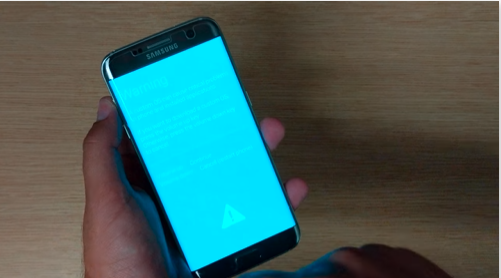

**20. Aperte a tecla volume para cima, o aparelho entrará em modo download;**

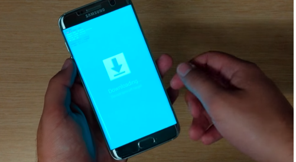

**21. Conecte o cabo usb no celular e computador, o Odin ira reconhecer o celular na "ID:COM", "devera ficar azul";**

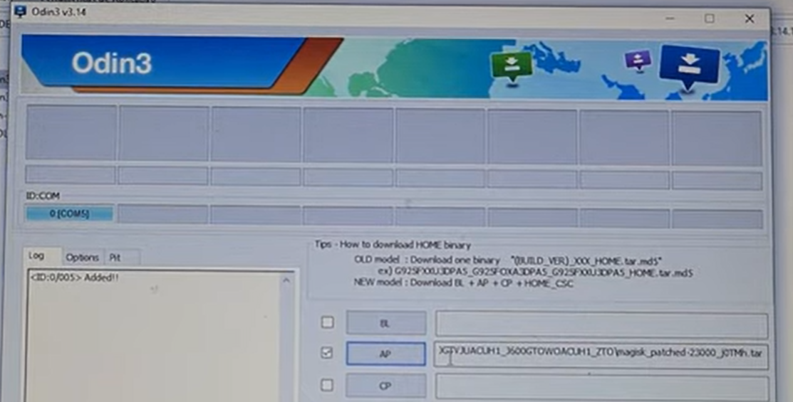

**22. Agora aperte a em "Start", Aguarde todo processo. Se não ocorrer nenhum problema o celular ira inicializar sozinho, com a configuração de fabrica, lembrando que o celular devera esta no mínimo 50% carregado. ""FAÇA POR SUA CONTA E RISCO"\".**

